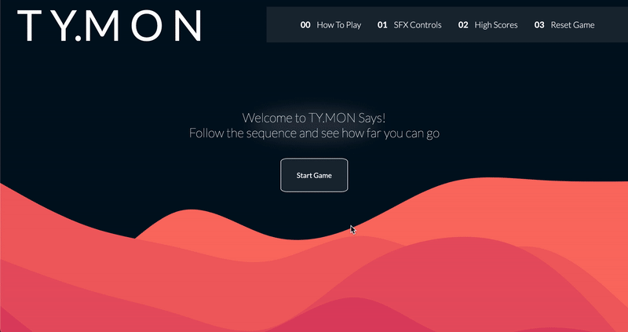
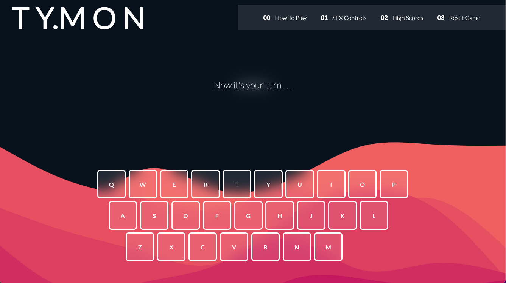
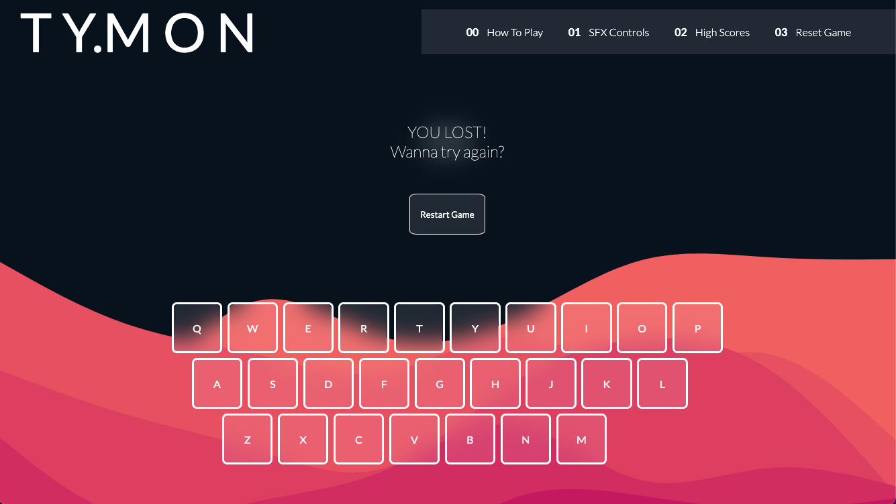
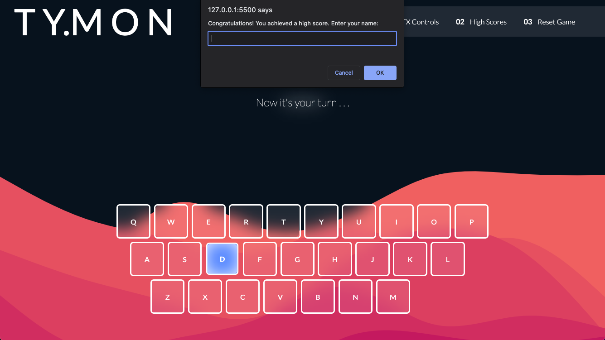
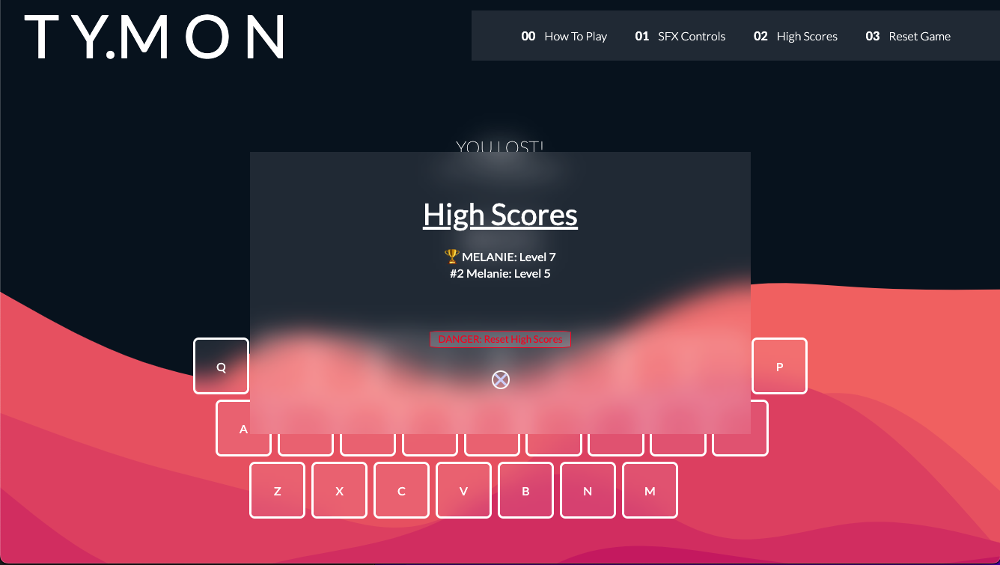
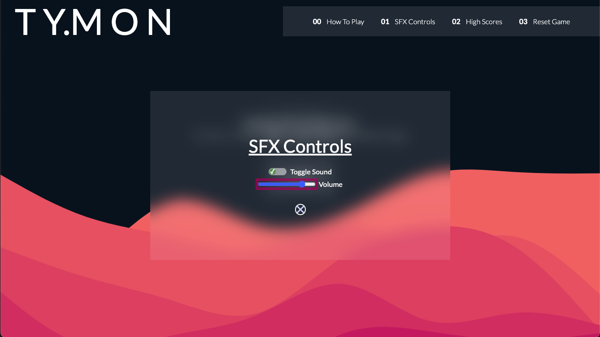

# TY.MON SAYS



## What is it?

Ty.Mon Says is a 'copy the sequence' type of game, just like SIMON. The twist is, you have a full keyboard to memorize, instead of just a few buttons. Good luck!

## Tech Stack

&nbsp;
&nbsp;
&nbsp;

- JavaScript
- HTML
- CSS

## Getting Started

[> > Play The Game Here! < <](https://melaniewinter.github.io/ty.mon-says/)

### Controls

- Utilize your computer keyboard or the onscreen buttons to follow the sequences.
- The "Start", "Next Level", and "Play Again" buttons can all be clicked on directly, or just press the "Enter" key on your keyboard.
- You can click on the nav bar, or, open the associated popup by pressing the number on your keyboard associated with each element.
  - 0: How to Play
  - 1: SFX Controls
  - 2: High Scores
  - 3: Reset Game <i>(PLEASE NOTE: This reset functionality is locked in the start screen)</i>
- Close the popup with the "X" at the bottom, or the "Escape" key on your keyboard.

### How to Play

1. Click "Start Game" to begin level 1.
2. The computer will play its first sequence of one key. Make sure you memorize this key!
3. When the computer sequence is over, it's the player's turn. Click the key the computer demonstrated before.
4. If you successfully matched the computer sequence, you will be prompted to proceed the next level.
5. In each level, the computer will add an additional key to the sequence.
6. Continue matching the computers sequence to proceed to the next level.
7. If your sequence is not exactly the same, a button will appear asking if you would like to replay the game.

   - Each game has a totally randomized computer sequence.

8. If you achieved the highest level on your computer's localized memory, a prompt will appear for you to type in your name.

   - High scores can be viewed in the "High Scores" section of the navigation bar.

9. Play against friends, family, or even yourself to see who can reach the highest level!

## Screen Shots

### Responsive Design


### Player's Turn



### Losing Screen



### High Score




### SFX Controls



## User Stories

1. AAU, I want the option use my computer keyboard or the onscreen keys to play the game.

```js
keyEls.forEach((keyEl) => {
  keyEl.addEventListener("click", () => {
    handleKeyPress({ key: keyEl.id });
  });
});

document.addEventListener("keydown", handleKeyPress);

function handleKeyPress(event) {
  const key = event.key || event.target.id;
  if (keyboard.hasOwnProperty(key) && userInteractionEnabled) {
    playerKeyPressArray.push(key);
    const keyInfo = keyboard[key];
    keyInfo.active = true;
    handleKeyColor(keyInfo);
    handleKeyTone(keyInfo);
    setTimeout(() => {
      checkWinProgress();
      keyInfo.active = false;
    }, 200);
  }
}
```

2. AAU, I want a randomized computer sequence to play.

```js
function pickRandomKey() {
  const keys = Object.keys(keyboard);
  const randomIndex = Math.floor(Math.random() * keys.length);
  const randomKey = keys[randomIndex];
  keyPatternArray.push(randomKey);
  return randomKey;
}
```

3. AAU, I want to level up every time I get the computer sequence correct.

```js
function leveler() {
  level++;
  playerKeyPressArray = [];
  pickRandomKey(keyboard);
  setTimeout(() => {
    playKeyPattern();
  }, 500);
  getRandomMessage();
  userInteractionEnabled = false;
}
```

4. AAU, I want a high score display so I can be competetitive with my housemates.

```js
function updateHighScoreDisplay() {
  highScoreList.innerHTML = "";
  highScores.forEach((score, index) => {
    const entry = document.createElement("div");
    entry.classList.add("high-score-entry");
    const rankContent = index === 0 ? "🏆" : `#${index + 1}`;

    entry.innerHTML = `<span class="rank">${rankContent}</span> ${
      score.playerName
    }: Level ${score.level - 1}`;
    highScoreList.appendChild(entry);
  });
}

function updateHighScore() {
  const playerName = prompt(
    "Congratulations! You achieved a high score. Enter your name:"
  );

  if (playerName) {
    const newScore = { level, playerName };
    highScores.push(newScore);
    highScores.sort((a, b) => b.level - a.level);
    highScores = highScores.slice(0, 6);

    localStorage.setItem("highScores", JSON.stringify(highScores));
    updateHighScoreDisplay();
  }
}
```

5. AAU, I want the keys to illuminate and play a tone during the sequence.

```js
function handleKeyColor(keyInfo) {
  if (keyInfo.active === true) {
    const keyEl = document.getElementById(keyInfo.label.toLowerCase());
    keyEl.style.backgroundColor = keyInfo.color;
    keyEl.classList.add("active");
    setTimeout(() => {
      keyEl.style.backgroundColor = "";
      keyEl.classList.remove("active");
    }, 200);
  }
}

function handleKeyTone(keyInfo) {
  playTone(keyInfo.tone, 0.2);
}

function playTone(frequency, duration) {
  if (isSoundOn) {
    const oscillator = audioContext.createOscillator();
    oscillator.type = "sine";
    oscillator.frequency.setValueAtTime(frequency, audioContext.currentTime);
    oscillator.connect(gainNode);
    oscillator.start();
    oscillator.stop(audioContext.currentTime + duration);
  }
}
```

6. AAU, I want my keys to be locked while the computer sequence is playing.

```js
function playKeyPattern() {
  userInteractionEnabled = false;
  gamePhase = "default";
  computerTurn();
  let i = 0;
  function playNextKey() {
    const key = keyPatternArray[i];
    const keyInfo = keyboard[key];
    keyInfo.active = true;
    handleKeyColor(keyInfo);
    handleKeyTone(keyInfo);
    setTimeout(() => {
      keyInfo.active = false;
      i++;
      if (i < keyPatternArray.length) {
        setTimeout(playNextKey, 350);
      } else {
        setTimeout(() => {
          userInteractionEnabled = true;
        }, 200);
        playerTurn();
      }
    }, 350);
  }
  playNextKey();
}
```

7. AAU, I want my input to be cross-referenced with the computer sequence. If it's not the same, the game should end immediately.

```js
function checkWinProgress() {
  const partialPattern = keyPatternArray.slice(0, playerKeyPressArray.length);

  for (let i = 0; i < playerKeyPressArray.length; i++) {
    if (playerKeyPressArray[i] !== partialPattern[i]) {
      userInteractionEnabled = false;
      gamePhase = "reset";
      losingMessage();
      playAgain();
      if (level - 1 > getHighestLevel()) {
        updateHighScore();
      }
      return;
    }
  }
  if (playerKeyPressArray.length === keyPatternArray.length) {
    userInteractionEnabled = false;
    gamePhase = "level";
    nextLevel();
    return;
  }
}
```

8. AAU, I want to be able to lower the volume or completely turn off the key tones.

```js
function toggleSound() {
  isSoundOn = !isSoundOn;
}

volumeControl.addEventListener("input", () => {
  const volumeValue = parseFloat(volumeControl.value);
  setVolume(volumeValue);
});

function setVolume(volume) {
  gainNode.gain.setValueAtTime(volume, audioContext.currentTime);
}
```

## Next Steps

- Adding different modes for difficulty
- Having the high scores be server based, rather than local
- Implement better accessibility features
- Make the layout more responsive for mobile
